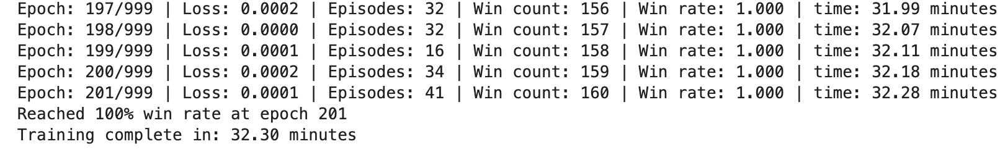
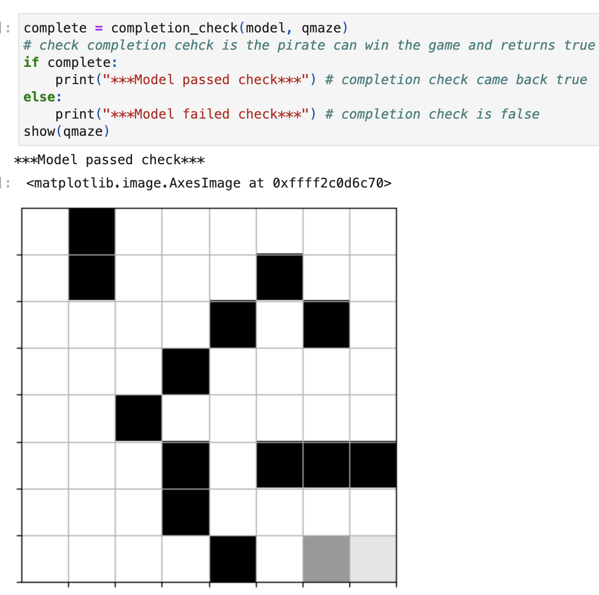
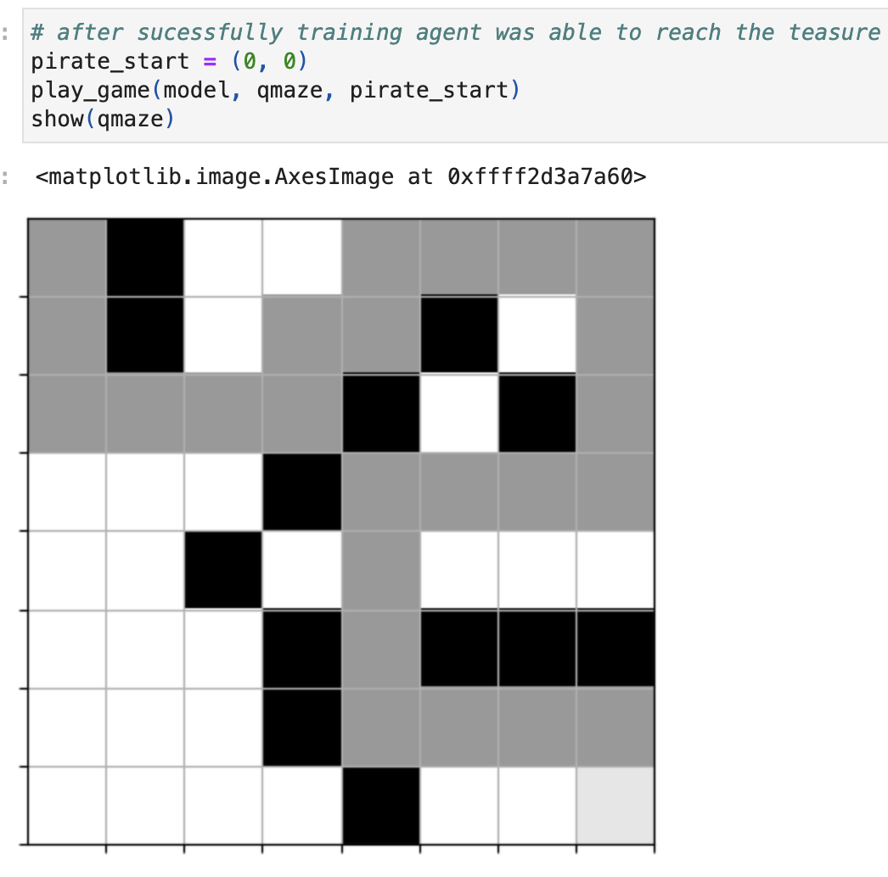
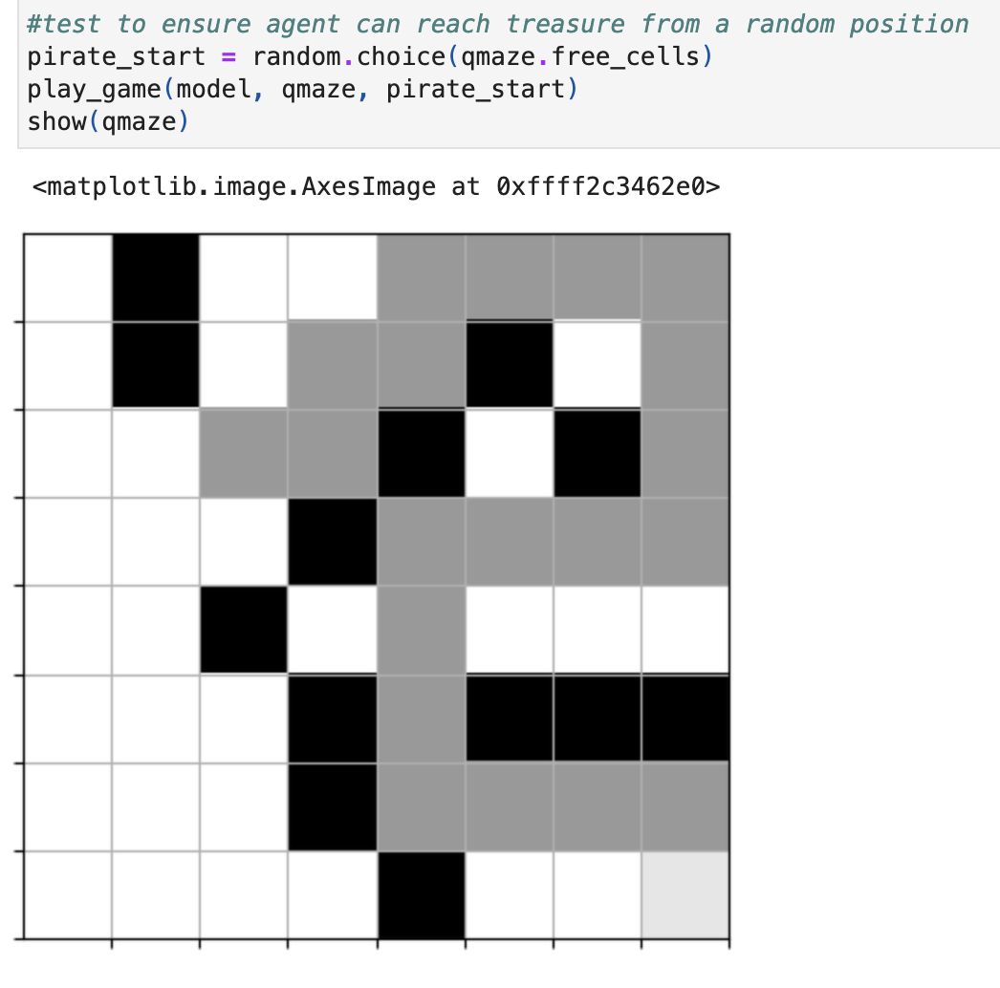

# CS370
*Contains my Final project from the term*

## Functionality and purpose
The Treasure Hunt project uses reinforcement learning to train an AI agent (a pirate) to find treasure in a maze. The main game code was already written, **my part was completing the training model qtrain function**. The agent learns by exploring the maze, earning rewards for finding treasure and penalties for hitting walls. Over time, it improves and finds the best path to the treasure on its own.

## Preview 👀

## To get a local copy up and running follow these steps 🏃💨 
- Download zip file (project) containing 
  - TreasureHuntGame.ipynb
  - GameExperience.py
  - TreasureMaze.py
  - requirements.txt
- Launch Jupyter notebook and open TreasureHuntGame.ipynb
- Run all cells

## Tools (HyperLink to download) 🛠️
  - [Python 3.8+](https://www.python.org/downloads/) – programming language
  - [TensorFlow](https://www.tensorflow.org/install) – deep learning framework for building and training models  
  - [Keras](https://keras.io/getting_started/) – high-level neural networks API running on top of TensorFlow 
 

## Additional Resources 📚
- Juypter notebook is the development environment used to develop and test the code
- Matplotlib - create interactive plots 
- Numpy - mathematical operations

## Reflection 📝
### **What do computer scientists do and why does it matter?**

Computer scientists solve problems efficiently by creating technology that makes tasks easier and more accessible for everyone. By building intelligent systems, software, and algorithms, they allow people to focus on their actual work in their own fields, rather than spending time on repetitive or complex tasks.

### **How do I approach a problem as a computer scientist?**

When approaching a problem, the first step is to understand the goal and break it down into smaller, manageable steps. For the Treasure Hunt project, this meant thinking about how the pirate agent should learn to navigate the maze. First I researched different ways to implement until I had a solid foundation. Next, I created pseudocode for the training process, which included deciding how the agent would explore and exploit, how experiences would be stored, and how the model would improve over time. 

### **What are my ethical responsibilities to the end user and the organization?**

My ethical responsibilities to the end users and the organization involve ensuring that whatever I develop is reliable, safe, and transparent. This includes writing code that behaves as expected, does not cause harm, and respects the trust of both users and the organization. I must also be honest about the capabilities and limitations of my work, clearly documenting how it functions and communicating this to the end users so that any decisions made by the system are fully understood.
